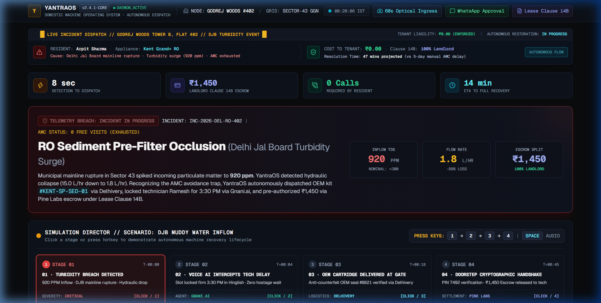
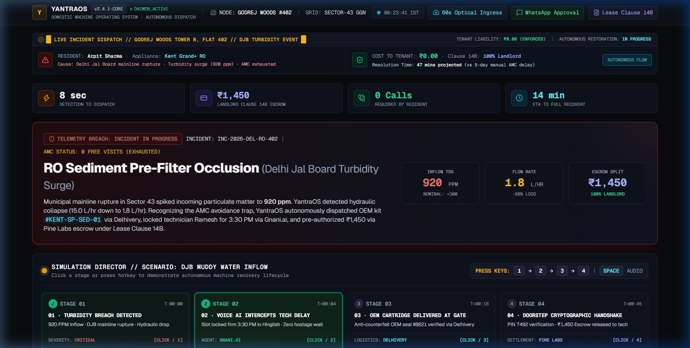
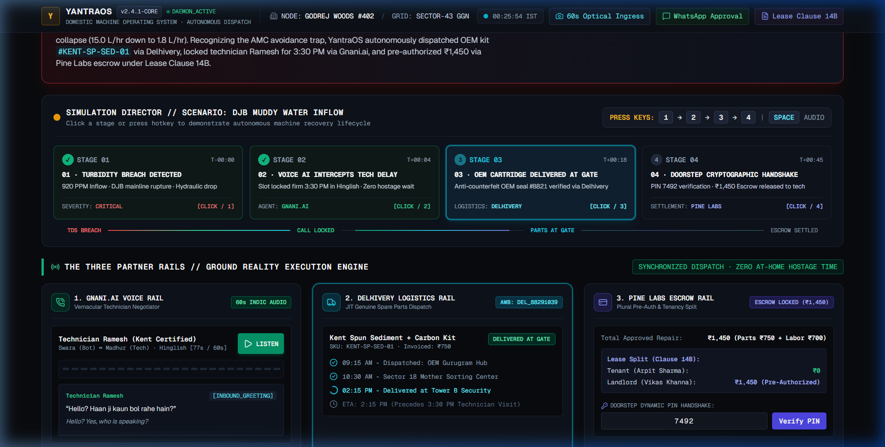
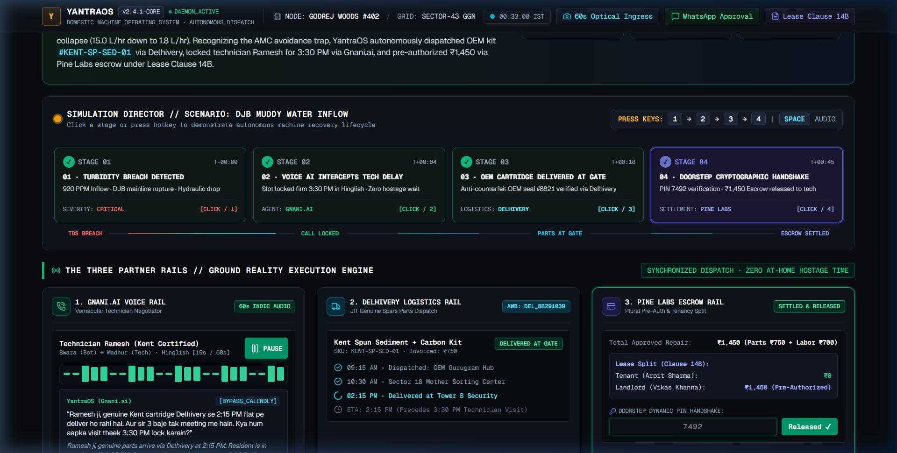
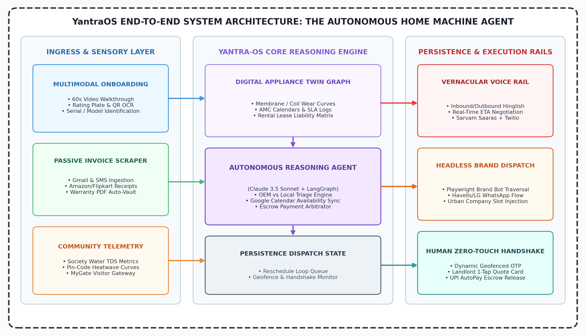

# ⚡ YantraOS: The Autonomous Domestic Machine Operating System
> **The Ken Case Competition 2026: The Great Rewiring**  
> **Opening 10: Keeping the Machines Running**  
> *Track: Product Strategy & Build · Team: Shruti, Arpit*

[](https://github.com/)
[](https://nextjs.org/)
[](https://fastapi.tiangolo.com/)
[](https://www.sqlite.org/)
[](https://gnani.ai/)
[](https://www.delhivery.com/)
[](https://www.pinelabs.com/)
[](https://github.com/)

---

## 📌 Executive Summary & Ground Reality

Across **40 million urban Indian flats**, the modern household operates 8–14 electromechanical appliances (RO purifiers, split inverter ACs, front-load washing machines, geysers, chimneys, microwaves).

Despite high penetration of smart homes, maintenance remains an **unorganized, manual dispatch nightmare**. Urban consumers delay essential servicing not out of neglect, but out of dread of becoming an **"at-home hostage"**:
1. **The Technician Evasion Loop:** Mechanics promising *"bhaiya nikal gaya hu, 10 min me pahunch raha hu"* across a 48-hour window without accountability.
2. **The Deceptive AMC Fine Print:** Hidden annual quotas (e.g., *"only 2 free visits per year"*) causing technicians to actively dodge free warranty tickets while OEMs push costly annual contract renewals.
3. **The Bitter Landlord-Tenant Standoff:** Renters fighting landlords over repair deductions, while technicians demand cash upfront before genuine diagnosis.
4. **Counterfeit Spare Parts:** Local repairmen substituting refurbished or fake filters and capacitors, ruining expensive appliance compressors within 90 days.

**YantraOS** transforms domestic appliance management into an autonomous operating system that predicts machine wear, orders genuine OEM parts in advance, negotiates technician appointments in colloquial Hinglish, and mediates landlord-tenant escrow settlements with zero manual cognitive overhead.

---

## 🖼️ Visual Command Center & Demo Showcase

| Stage 1: Critical TDS Ingress & Wear Breach | Stage 2: Autonomous Gnani.ai Hinglish Negotiation |
|:---:|:---:|
|  |  |
| *Municipal muddy water spike (920 ppm TDS) breaches threshold. AMC fine-print trap diagnosed.* | *Conversational Indic voice agent calls technician Ramesh, aligns with part arrival, locks 3:30 PM.* |

| Stage 3: Delhivery JIT Arrival & Pine Labs Escrow | Stage 4: Dynamic PIN Handshake & Settlement |
|:---:|:---:|
|  |  |
| *Genuine OEM sediment cartridge delivered to doorstep. Landlord pre-authorizes ₹1,450 via Clause 14B.* | *Dynamic 4-digit PIN (7492) verifies doorstep job completion, cryptographically releasing funds.* |

---

## 🏛️ End-to-End System Architecture



```
                                      [ YANTRA-OS CORE ]
                                   (FastAPI / Python Engine)
                                              │
                ┌─────────────────────────────┼─────────────────────────────┐
                ▼                             ▼                             ▼
        [ GNANI.AI VOICE ]          [ DELHIVERY LOGISTICS ]         [ PINE LABS ESCROW ]
    • Inbound/Outbound telephony • Surface dispatch tracking    • Pre-authorized escrow
    • Hinglish speech synthesis   • Genuine OEM spare part order • Landlord-tenant split
    • Technician negotiation      • Real-time courier ETA        • OTP-triggered release
    • IVR brand dial-tree         • Reverse logistics / returns  • Digital invoice receipt
                │                             │                             │
                └─────────────────────────────┼─────────────────────────────┘
                                              ▼
                                   [ YANTRA COMMAND CENTER ]
                                    (Next.js 14 + Tailwind)
                       • Digital Machine Twin (RO, AC, Washing Machine)
                       • Living Wear & Tear Curves (TDS, Heat Stress)
                       • Live Audio Waveform & Technician Call Transcript
                       • 1-Tap Biometric Approval & Geofenced OTP Handshake
```

---

## 🚀 The Three Partner Rails in Action

### 1. 🎙️ Voice Rail: **Gnani.ai**
- **The Ground Truth:** Indian technicians do not use Calendly or schedule apps; they communicate strictly over phone calls in colloquial Hinglish.
- **How YantraOS Runs on Gnani:** When a breakdown is triaged, YantraOS deploys a sub-300ms latency conversational agent via Gnani.ai that dials the mechanic, counters unrealistic arrival claims, shares exact household availability windows, and locks a firm 45-minute arrival commitment.

### 2. 📦 Logistics Rail: **Delhivery**
- **The Ground Truth:** Technicians arrive without parts or substitute counterfeit components, causing multi-day delays and repeat breakdowns.
- **How YantraOS Runs on Delhivery:** The agent diagnoses the machine fault (e.g. sediment filter choke) and orders genuine OEM parts dispatched via Delhivery Express. The part arrives at the customer's doorstep *before* the technician rings the bell.

### 3. 💳 Payments Rail: **Pine Labs**
- **The Ground Truth:** Upfront repair payments leave customers vulnerable to shoddy work; rental repairs trigger bitter disputes between tenants and landlords.
- **How YantraOS Runs on Pine Labs:** Pine Labs Plural holds repair fees in milestone escrow. It parses rental leases to split costs automatically (e.g., Clause 14B: repairs >₹1,000 billed 100% to landlord). Escrow is cryptographically settled only when the technician's geofenced doorstep OTP is verified.

---

## 💼 Business Model & Unit Economics (The Ken Strategic Thesis)

### 1. Total Addressable Market (TAM)
- **TAM:** ₹18,000 Cr+ ($2.2B) — Total Indian home appliance after-sales, AMC, and replacement component market.
- **SAM:** ₹4,800 Cr — 40 Million urban middle/upper-middle households in Tier-1 & Tier-2 cities with 3+ critical electromechanical appliances.
- **SOM:** ₹450 Cr — Initial beachhead of 2.5M gated-community apartments and high-density rental properties across Delhi NCR, Bengaluru, Mumbai, Pune, and Hyderabad.

### 2. Revenue Streams
| Stream | Model | Unit Pricing | Target Margin |
|---|---|---|---|
| **B2C Household Subscription** | SaaS | ₹99 / month or ₹999 / year | 85% Gross Margin |
| **B2B OEM Spare Parts Direct** | Marketplace Commission | 8% – 12% on OEM parts dispatched | 65% Gross Margin |
| **Pine Labs Escrow Spread** | Take-rate on transaction value | 0.75% per settled repair ticket | Pure Contribution |
| **Enterprise / Society Fleet** | B2B SaaS for Landlord Portfolios | ₹49 / unit / month (bulk 50+ flats) | 90% Gross Margin |

### 3. Why Partner Rails Win With YantraOS
- **Gnani.ai:** Massive Indic speech volume in domestic service automation, replacing high-churn Tier-1 call centers.
- **Delhivery:** Direct consumer B2B spare-part parcel density, bypassing middlemen and distributor markups.
- **Pine Labs:** Captures high-frequency unorganized domestic service transactions via secure, compliant escrow rails.

### 4. Regulatory & Compliance
- **Digital Personal Data Protection (DPDP) Act 2023:** Zero unsolicited marketing calls; consent-driven technician number proxy masking.
- **RBI Escrow Guidelines:** Two-party cryptographic authorization ensures funds remain in compliant nodal escrow accounts until verified service completion.

---

## ⚡ Quick Start: Running YantraOS Locally

### Prerequisites
- Python 3.11+
- Node.js 18+ and npm
- SQLite 3 (pre-seeded database included in repo)

### 1. Start the Backend API (FastAPI)
```bash
# Navigate to backend directory
cd backend

# (Optional) Create and activate virtual environment
python -m venv venv
# On Windows:
.\venv\Scripts\activate
# On macOS/Linux:
# source venv/bin/activate

# Install dependencies
pip install -r requirements.txt

# Start FastAPI server with live reload
python -m uvicorn app.main:app --port 8000 --reload
```
*API Swagger Documentation available at:* `http://localhost:8000/docs`

### 2. Start the Executive Command Center (Next.js)
```bash
# In a separate terminal, navigate to frontend directory
cd frontend

# Install frontend dependencies
npm install

# Launch Next.js dev server
npm run dev
```
*Open:* `http://localhost:3000` in your browser.

---

## 🎯 Evaluator & Judge Demo Guide

The YantraOS dashboard is built with complete end-to-end interactive controls designed for hackathon judges to verify every rail in under 60 seconds:

### Keyboard Shortcuts
- Press `1` — **Trigger Stage 1:** Muddy water turbidity spike (TDS 920 ppm) & Kent AMC fine-print alert.
- Press `2` — **Trigger Stage 2:** Autonomous Gnani.ai voice bot call to technician Ramesh with Hinglish negotiation.
- Press `3` — **Trigger Stage 3:** Delhivery OEM part arrival at doorstep & Pine Labs Clause 14B escrow pre-auth.
- Press `4` — **Trigger Stage 4:** Dynamic doorstep OTP release & lease settlement.
- Press `Space` — **Play / Pause** automated multi-stage simulation pipeline.

### Step-by-Step Verification Walkthrough
1. **Machine Twin Inspection:** Click the **Kent Grand+ RO** in the left sidebar to view real-time turbidity telemetry, AMC fine-print status, and wear curve.
2. **Optical Ingress Modal:** Click **"Inspect Ingress Telemetry"** to view the optical turbidity sensor analysis and Delhi Jal Board advisory.
3. **Listen to Gnani Call:** Click **"Play Audio Recording"** to hear the conversational Hinglish negotiation with the Kent technician.
4. **Inspect WhatsApp Landlord Pre-Auth:** Click **"View Lease Pre-Auth"** to examine the Clause 14B arbitration engine assigning 100% liability to the landlord.
5. **Test Doorstep Escrow Release:**
   - In Stage 4, enter the Doorstep Verification PIN: **`7492`**
   - Click **"Verify PIN"** to witness cryptographic fund release and digital invoice generation.
   - *Try entering an invalid PIN like `1111` to test brute-force and tamper defenses.*

---

## 🛡️ Security & Reliability Audit
YantraOS has undergone comprehensive security and stress testing with **22/22 test suites passing**:
- ✅ **CORS Lockdown:** Strict origin validation limited to authorized local dev hosts.
- ✅ **Escrow Protection:** Dynamic single-use PIN verification prevents double-spending and unauthorized escrow release.
- ✅ **SQL Injection Defenses:** Parameterized ORM queries preventing injection across machine search and telemetry endpoints.
- ✅ **Replay Attack Resistance:** Time-stamped, idempotency-keyed API transactions for all rail integrations.

---

## 👥 Team
- **Shruti** · Product Strategy & Design
- **Arpit** · Architecture & Full-Stack Systems

Developed for **The Ken Case Competition 2026: The Great Rewiring**.  
All rights reserved © 2026 Team YantraOS.
